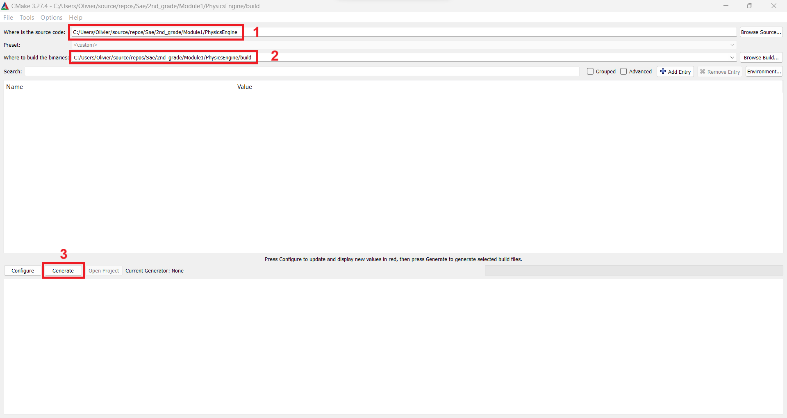
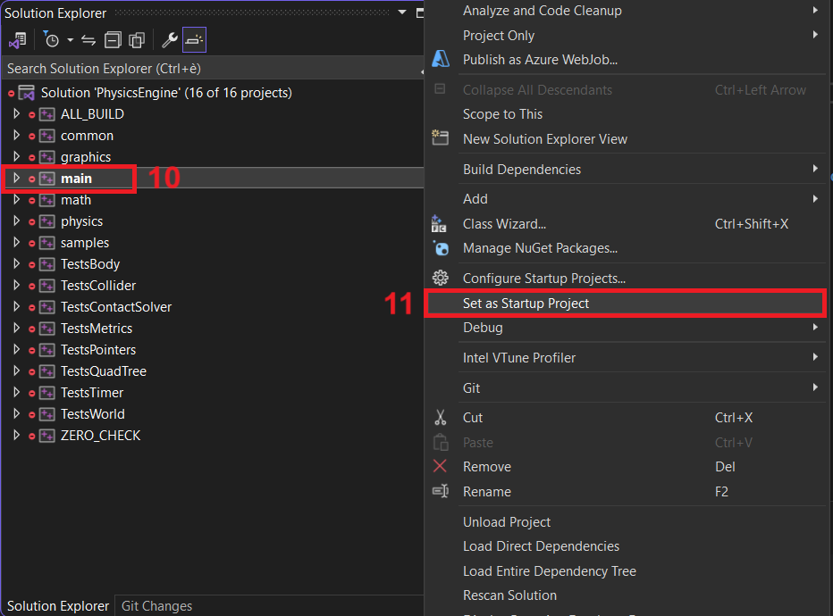
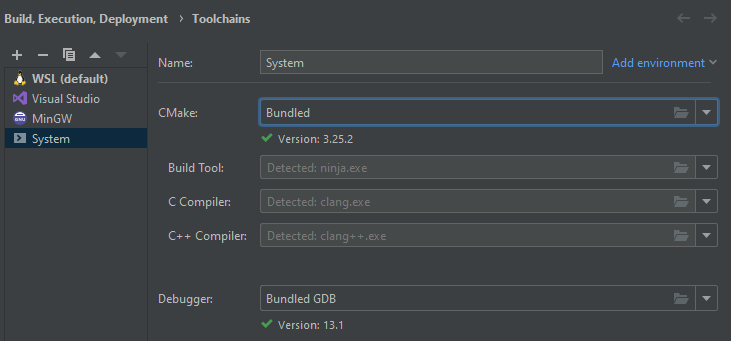

[Return](../README.md)

# How to build the project ?

## Visual Studio

- Open CMake https://cmake.org/download/

- Step 1: Enter Path to project

- Step 2: Enter Path to Build (create a new empty folder if doesn't exists already)

- Step 3: Press `Generate`

- Step 4: Select `Visual studio 17 2022`

- Step 5: Select `Specify toolchain for cross-compiling`

- Step 6: Press `Next`

- Step 7: Enter Path to vcpkg.cmake https://github.com/microsoft/vcpkg

- Step 8: Press `Finish`

- Step 9: Press `Open Project` (if it does nothing, go to `Build` and Open `Bark.sln` with `Visual Studio`)

- Step 10: Right click on `main`

- Step 11: Press `Set as Startup Project`

- You can now navigate through the samples using the `ImGui` window.

## CLion

- Go to `File` -> `Settings` -> `Build, Execution, Deployment` -> `Toolchains` -> `+` -> `System`

1. Go to `File` -> `Settings` -> `Build, Execution, Deployment` -> `CMake` -> add a new profile with the toolchain you just created named `Debug`
2. Set `CMake options` to `-DCMAKE_TOOLCHAIN_FILE="<path to vcpkg>/scripts/buildsystems/vcpkg.cmake"`,

- Go to `CMakeLists.txt` and reload it
